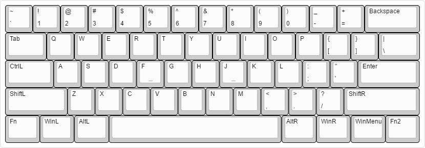

:bird: crow
====
Custom 60% keyboard

[](https://isocpp.org)
[](https://github.com/dawikur/crow/releases)
[](https://github.com/dawikur/crow/blob/master/LICENSE)

[](https://travis-ci.org/dawikur/crow)
[](https://www.arduino.cc/en/Main/ArduinoBoardMicro)


.png)
.png)

About
=====

I am Vim user, so many keys (```Insert```, ```Page Up```, etc) are placed as commands in Vim.
